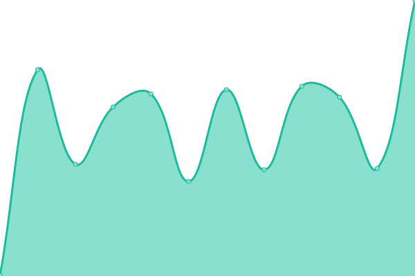
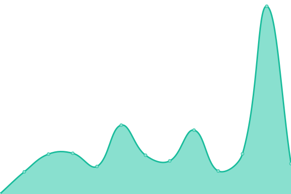

# [📈 Live Status](https://status.bbaovanc.com): <!--live status--> **🟧 Partial outage**

This repository contains the open-source uptime monitor and status page for [BBaoVanC](https://bbaovanc.com), powered by [Upptime](https://github.com/upptime/upptime).

With [Upptime](https://upptime.js.org), you can get your own unlimited and free uptime monitor and status page, powered entirely by a GitHub repository. We use [Issues](https://github.com/BBaoVanC/status.bbaovanc.com/issues) as incident reports, [Actions](https://github.com/BBaoVanC/status.bbaovanc.com/actions) as uptime monitors, and [Pages](https://status.bbaovanc.com) for the status page.

<!--start: status pages-->
<!-- This summary is generated by Upptime (https://github.com/upptime/upptime) -->
<!-- Do not edit this manually, your changes will be overwritten -->
<!-- prettier-ignore -->
| URL | Status | History | Response Time | Uptime |
| --- | ------ | ------- | ------------- | ------ |
|  [Main Site](https://bbaovanc.com) | 🟥 Down | [main-site.yml](https://github.com/BBaoVanC/status.bbaovanc.com/commits/HEAD/history/main-site.yml) | 

 303ms
     
 | 

<a href="https://status.bbaovanc.com/history/main-site">99.89%</a>
    

|  [Searx](https://searx.bbaovanc.com) | 🟥 Down | [searx.yml](https://github.com/BBaoVanC/status.bbaovanc.com/commits/HEAD/history/searx.yml) | 

 290ms
     
 | 

<a href="https://status.bbaovanc.com/history/searx">99.36%</a>
    

|  [Gitea](https://git.bbaovanc.com) | 🟥 Down | [gitea.yml](https://github.com/BBaoVanC/status.bbaovanc.com/commits/HEAD/history/gitea.yml) | 

 344ms
     
 | 

<a href="https://status.bbaovanc.com/history/gitea">99.90%</a>
    

|  [Images](https://img.bbaovanc.com) | 🟥 Down | [images.yml](https://github.com/BBaoVanC/status.bbaovanc.com/commits/HEAD/history/images.yml) | 

 318ms
     
 | 

<a href="https://status.bbaovanc.com/history/images">99.91%</a>
    

|  [Drone CI](https://drone.bbaovanc.com/bbaovanc/pynamegen) | 🟥 Down | [drone-ci.yml](https://github.com/BBaoVanC/status.bbaovanc.com/commits/HEAD/history/drone-ci.yml) | 

 237ms
     
 | 

<a href="https://status.bbaovanc.com/history/drone-ci">99.91%</a>
    

|  [Media](https://media.bbaovanc.com/test) | 🟩 Up | [media.yml](https://github.com/BBaoVanC/status.bbaovanc.com/commits/HEAD/history/media.yml) | 

 267ms
     
 | 

<a href="https://status.bbaovanc.com/history/media">99.92%</a>
    

<!--end: status pages-->

[**Visit our status website →**](https://status.bbaovanc.com)

## 📄 License

- Powered by: [Upptime](https://github.com/upptime/upptime)
- Code: [MIT](./LICENSE) © [BBaoVanC](https://bbaovanc.com)
- Data in the `./history` directory: [Open Database License](https://opendatacommons.org/licenses/odbl/1-0/)
